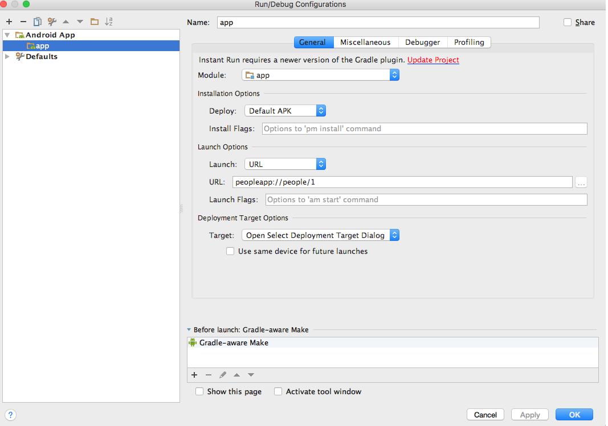

## Overview

React Native route-matching library to handle deep links.

## Installation

This package is distributed via npm:

```
npm install react-native-deep-linking
```

### Add deep link support to your app

#### For iOS:

#### 1. Make sure you have a URL scheme registered for your app in your Info.plist


#### 2. Add this to your AppDelegate.m

```objective-c
#import "RCTLinkingManager.h"

- (BOOL)application:(UIApplication *)application openURL:(NSURL *)url
  sourceApplication:(NSString *)sourceApplication annotation:(id)annotation
{
  return [RCTLinkingManager application:application openURL:url
                      sourceApplication:sourceApplication annotation:annotation];
}

// Only if your app is using [Universal Links](https://developer.apple.com/library/prerelease/ios/documentation/General/Conceptual/AppSearch/UniversalLinks.html).
- (BOOL)application:(UIApplication *)application continueUserActivity:(NSUserActivity *)userActivity
 restorationHandler:(void (^)(NSArray * _Nullable))restorationHandler
{
 return [RCTLinkingManager application:application
                  continueUserActivity:userActivity
                    restorationHandler:restorationHandler];
}
```

#### For Android:

#### 1. Add this your AndroidManifest.xml

```xml
<activity
    android:name=".MainActivity"
    android:label="@string/app_name"
    android:configChanges="keyboard|keyboardHidden|orientation|screenSize">
    <intent-filter>
        <action android:name="android.intent.action.MAIN" />
        <category android:name="android.intent.category.LAUNCHER" />
    </intent-filter>

    <intent-filter>
        <action android:name="android.intent.action.VIEW"/>
        <category android:name="android.intent.category.DEFAULT"/>
        <category android:name="android.intent.category.BROWSABLE"/>
        <data android:scheme="exampleapp"
            android:host="greetings"
            android:pathPrefix="/" />
    </intent-filter>
</activity>
```

#### 2. To test this out, open Android Studio. Open Run -> Edit Configurations and change the launch options to URL, passing in the following url: ```exampleapp://greetings/```



#### or

#### command-line

```
adb shell am start -a android.intent.action.VIEW -d "exampleapp://greetings/World" com.reactnativedeeplinkingexample
```
